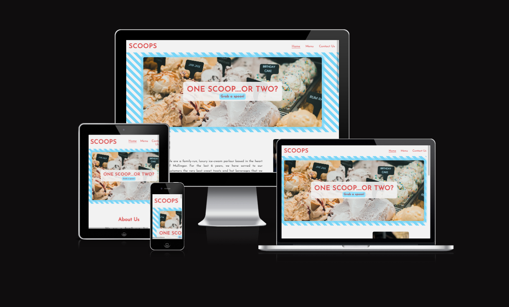

# SCOOPS Ice Cream Parlour 

[View live project here on GitHub](https://amylour.github.io/scoops_pp1/)

SCOOPS Ice-Cream Parlour is a family run, local business in Mullingar, Co.Westmeath. Providing home baked warm goods, memorable ice-cream desserts and delicious hot in a cosy environment. The site was designed to invoke a nostalgic, homely feeling that centered completely around the product; traditionally-made fresh ice cream. The site's intention was to be a clear, dependable reference for every visit.

---

---

# Contents  
  
### - UXD (User Experience Design)  
### - Creation process (Strategy -> Surface)  
### - Page Features  
### - Design  
### - Technologies Used  
### - Testing  
### - Deployment  
### - Credits  

---

## User Experience (UX)  
---  

### Primary Goal  
  
SCOOPS Ice Cream Parlour is a friendly, local ice cream parlour located just off the main shopping thoroughfare of Mullingar, Co.Westmeath, Ireland. They needed a clear and striking website design that reflected their traditional flavours and values. 

### Visitor Goals  
  
SCOOPS customers vary in age from child to elderly adult and it was a requirement that the website be straight to the point and easy to use for those seeking information about the menu, location and opening times. The site was designed to be responsive to allow visitors to view it from a range of devices and the menu was to have decipherable font from either portrait or landscape orientation. It was important for opening times and location of the shop to be accessible from every page via the footer. In addition, an interactive Google Map was requested to direct those not familiar with the town.  
    
### User Stories  
  

---

## Creation Process  
  
### 1. Strategy  

There was a clear need for an attractive and accessible website to represent this ice cream parlour and continue to drive their business. It is not the only shop in Mullingar offering desserts, but it has the advantage of having a high footfall and a regular customer base. They required an easy to read, dependable website that delivered clear information about menu options and opening times. For new visitors to the town, location of the shop must be visible and social media links available to check for customer reviews. The retro aesthetic of SCOOPS was to be carried on throughout the website with the use of consistent, clean design and use of graphics and colour to evoke an emotional and familiar connection for the customer. Pricing within the menu page was to be transparent and simple, reflecting SCOOPS preferred no-fuss approach of giving the customer exactly what they want.
  

### 2. Scope  

The SCOOPS site must be available on a wide range of devices due to the varied range of customer ages. A large portion of their client base is the retired, over-60 age group, comprising mostly of grandparents bringing their grandchildren out for a weekly treat. SCOOPS provides a comfortable, no-fuss, homely environment for its dine-in patrons and they wished for this to be reflected in the website. The site was to contain only essential information, presented in a similar fashion and layout. Text must be clear and legible on any sized device to allow the customer instant access to the menu, location and opening times. SCOOPS wished for a brief history of their business to be included to strengthen their 'homemade, local' brand. For future developement, an ordering system for party/catering requests was discussed, as was a large gallery page featuring images of their famous ice cream flavours, sundae specials and candid shots of their regular clientele and staff at seasonal events.
  

### 3. Structural  

Similar to the request of the design and layout being accessible and functional, simple navigation and interactivity was essential. It was necessary that the site provide information swiftly no matter the age of the user. Easy to identify, clickable links with a consistent layout. The design was to be predictable for each page with the information clearly identifiable. Any buttons or links had to provide feedback to the user to identify their purpose in the form of a design change that followed the flow of the overall aesthetic. A large, clear button to bring the user directly to the menu would be placed front and center of their eye-line. In addition, a navigation bar and footer would be visible on every page, at every device size, displaying the same information. This would provide the returning customer with a faster route to their information-destination, strengthening the site's familiar and trusting feeling.  

  
### 4. Skeleton  

The site was developed within the client's expectation to be simple, clear and familiar -  
For the landing page, the client's logo, SCOOPS, was to be top-left of every page, no matter the orientation or screen size. The simple, three item navigation bar of 'Home', 'Menu' and 'Contact Us', situated always to the right of the logo. An underline feature identifying the current page and whether a cursor or touch was accurate. A large, clear image dominates the landing page with a close-up view of the available ice cream flavours, their texture visible. Centered in the image is a tagline featuring a phrase used constantly at SCOOPS, with the answer, a large, clickable button situated immediately below it. For first time visitors, they have access to the menu with one easy, click. For returning or curious visitors, scrolling down the page introduces them to a brief, three piece, information section about the SCOOPS business. Images are visible to one side of the headed paragraphs. The page ends with the footer, again offering three pieces of important information to the user, opening times, location and social media.  

For the menu page, the navigation bar and footer remain as before. Between these lies the menu items laid out in identifiable, headed sections. An image of the most requested dessert features at the end of the menu, to assist the visitors decision.  
  
For the contact us page, the navigation and footer remain as before. Two sections are presented with explanatory headings. An optional form for visitors who wish to connect with the business with an interactive Google Map with the business location pinned. Their is an option to enlarge the map in a new window and find directions. Below the map again are the location details for the shop with a phone number to contact them.  
  

### 5. Surface  

The visual language of the SCOOPS site was within the primary discussion with the client. It was as important as the sites functionality. A design was created that allowed a consistent flow through the three, page site  

---
## Page Features  
### - Navbar  
[screenshot of navbar]  
### - Banner Image
[screenshot of banner image]  
### - Tagline & Call to Action  
[screenshot of tagline and button]  
### - Business Ethos  
[screenshot of ethos and images]  
### - Menu Page  
[screenshot of menu page]  
### - Contact Us Page  
[screenshot of contact us page]  
### - Footer  
[screenshot of footer]  
  
## Mobile View  
### - How Desktop changed to ensure responsiveness  
### - Imagery Changes  
[screenshots fixed and rollout]  

## Future Features  

-Adding video of walkthrough of the ice cream parlour  
-Ordering system for tubs of ice cream and cakes  
  
---  
  
  ## Design  
  ### - Color Scheme  
    Adobe Kuler  
    Accesibility tests  
    Lighthouse  
    [screenshots]  
      
### - Imagery  
    Wanting a retro, paperlike feel, issues with contrast ratios for colors, wrapper/sleev of ice cream cone, branding  
    pexels.com  
    unsplash.com  
  
### - Font/Typography  
    Josefin sans/Lato - Josefin used throughout. Josefin not appearing on Safari - how to overcome  
    Google Fonts  
    Adobe Font Library  
  
### - Wireframes  
    Desktop, iPad, Mobile  
    [screenshots]  
    Wireframes done pen and paper, thidied up in Procreate, will develop further on Balsamiq/Figma  
  
### - Frameworks/Libraries/Programs Used  
    Google Fonts  
    Fntawesome  
    Git/GitHub/GitPod  
    Procreate  
    Balsamiq  
    Adobe Image Resizer  
    Adobe Color  
  
---  
## Technologies Used  
  
  -Created on Google Chrome browser, use of Chrome Developer Tools  
  -Tested on Chrome, Firefox, Safari (iPad Pro), Android, iOS (iPhone SE)  
  -Languages  
    HTML5  
    css3  
    Git  
  
---  
## Testing  
  
### -HTML Validation using W3C Validation  
[screenshot of validation]  
### -CSS Validation using W3C Validation  
[screenshot of validation]  
### -Lighthouse scores via Chrome Developer Tools  
[screenshots of validation]  
### -Adobe Color tool validation for contrast ratio/color blindness  
[screenshot of validation]  
-Links to official documentation downloaded from validation services  
  
### -Personal Testing  
Tested on Chrome (Acer Aspire3 laptop), Safari (iPad Pro), Android  
(Huawei p30 lite),  iOS (iPhone SE)  
Testing across browsers: Chrome, Firefox, Edge, Safari  
  
### - Bugs & Fixes  
White space RHS webpage - padding issue in footer - developer mistype  
Contrast ratio - adjusting colors  
Flexbox issues - business ethos and images spacing, footer rising  
Responsiveness  

---  

## Deployment  

-How site was deployed including live link  
Git/GitHub/GitPod  

--- 

## Credits  
  
### - Content References  
    Hero image zoom - Love Running Project  
    Diagonal line tutorial - dev.to/snkds/how-to  
    Google map embed - W3Schools  
    Flexbox tutorial - Mozilla Developer Tools/Flexbox Froggy  
### - Media References
    Images from pexels.com/unsplash.com  
    ~individuals name & image name  
### - Acknowledgements

