# SCOOPS Ice Cream Parlour 

[View live project here on GitHub](https://amylour.github.io/scoops_pp1/)

SCOOPS Ice-Cream Parlour is a family run, local business in Mullingar, Co.Westmeath. Providing home baked warm goods, memorable ice-cream desserts and delicious hot drinks in a cosy environment. The site was designed to invoke a nostalgic, homely feeling that centered around the product; traditionally-made fresh ice cream. The site's intention was to be a clear, dependable reference for every visit.  

   
  
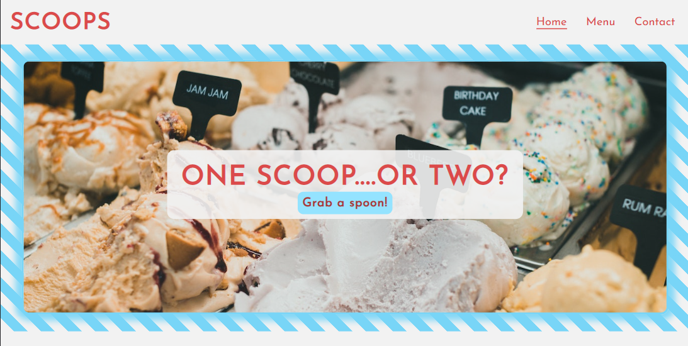

---

## CONTENTS  
  
* [UXD (User Experience Design)](#user-experience-ux)
  * [Primary Goal](#primary-goal)
  * [User Stories](#user-stories)
* [Creation process (Strategy -> Surface)](#creation-process)
  * [Strategy](#1-strategy)
  * [Scope](#2-scope)
  * [Structural](#3-structural)
  * [Skeleton](#4-skeleton)   
  * [Surface](#5-surface)
* [Design](#design)
  * [Colour Scheme](#color-scheme)
  * [Typography](#typography)
  * [Imagery](#imagery)
  * [Wireframes](#wireframes)   
* [Page Features](#page-features)
  * [Navbar](#navbar)
  * [Hero-Image](#hero-image)
  * [Tagline & Call to Action](#tagline--call-to-action)
  * [Business Ethos](#business-ethos)
  * [Menu Page](#menu-page)
  * [Contact Us](#contact-us-page)
  * [Footer](#footer)  
* [Mobile View](#mobile-view)
  * [Desktop/Tablet/Mobile Differences](#desktoptabletmobile-differences)
  * [Tablet View](#tablet-view-ipad-miniipad-prosurface-pro)
  * [Mobile View](#mobile-view-iphone-5iphone-seiphone-xriphone-12-pro)
* [Future Features](#future-features)
* [Technologies Used](#technologies-used)
  * [Languages Used](#languages-used)
  * [Frameworks, Libraries & Programs Used](#frameworkslibrariesprograms-used)
* [Deployment](#deployment)
  * [How to deploy](#how-to-deploy)
* [Testing](#testing)
* [Credits](#credits)  
  
---   
  

## User Experience (UX)  
  
### **User Stories**  

### **Primary Goal**  
  
SCOOPS Ice Cream Parlour is a friendly, local ice cream parlour. It needed a clear and striking website design that reflected the parlours traditional flavours and aesthetic. 

### **Visitor Goals** 

SCOOPS customers vary in age and it was a requirement that the website be straight to the point and easy to use for those seeking information about the menu, location and opening times. The site was designed to be responsive to allow visitors to view it from a range of devices and the menu was to have decipherable font from either portrait or landscape orientation. It was important for opening times and location of the shop to be accessible from every page via the footer. In addition, an interactive Google Map would be needed to direct those not familiar with the town.  

### **First Time Visitor**
  - A user can access each page of the site with one click via the navigation bar.
  - A user can access the menu and prices via the button located at the center of the landing page.
  - A user can view the opening times and location via the footer.
  - A user can find a map to the parlour via the navigation bar and footer.

### **Returning Visitor**  
  - A user can quickly access the menu via the landing page to check menu options and prices.
  - A user can learn about the business ethos by scrolling down the landing page.
  - A user can find social media links in the footer to learn more about SCOOPS.
  - A user can use the contact form to connect with the business.
  
### **Frequent Visitor**  
  - A user can see opening hours quickly by scrolling down the landing page.
  - A user can view the social media links to check for menu updates.    

---
   

## Creation Process  
  
### **1. Strategy**  

- I required an easy to read, dependable website that delivers clear information about menu options and opening times.  
- Location of the shop must be visible and social media links available.  
- The retro aesthetic of SCOOPS is to be carried on throughout the website with the use of consistent, clean design and use of graphics and colour to evoke an emotional and familiar connection for the user.  
- Pricing within the menu page is to be transparent and simple.  
- Mobile responsiveness is an essential feature required for this website.
  

### **2. Scope**  

The SCOOPS site must be available on a wide range of devices due to the varied range of customer ages. A large portion of their client base is the retired, over-60 age group, comprising mostly of grandparents bringing their grandchildren out for a weekly treat. SCOOPS provides a comfortable, no-fuss, homely environment for its dine-in patrons and they wished for this to be reflected in the website.  

- The site is to contain only essential information, presented in a similar fashion and layout.   
- Text must be clear and legible on any sized device to allow the user instant access to the menu, location and opening times.  
- A brief history of the business is to be included on the landing page.  
- For future developement, an ordering system for party/catering requests will be included. Also, a large gallery page featuring images of the ice cream flavours, sundae specials and candid shots of customers and staff.
  

### **3. Structural**  

Similar to the request of the design and layout being accessible and functional, simple navigation and interactivity was essential. It was necessary that the site provide information swiftly no matter the age of the user.  
- Easy to identify, clickable links with a consistent layout. The design was to be predictable for each page with the information clearly identifiable.  
- Any buttons or links had to provide feedback to the user to identify their purpose in the form of a design change that followed the flow of the overall aesthetic.  
- A large, clear button to bring the user directly to the menu would be placed front and center of their eye-line.  
- In addition, a navigation bar and footer would be visible on every page, at every device size, displaying the same information. This would provide the returning customer with a faster route to their information-destination, strengthening the site's familiar and trusting feeling.  

  
### **4. Skeleton**  

The site was developed to be simple, clear and familiar.  

- For the landing page, the logo, SCOOPS, was to be top-left of every page, no matter the orientation or screen size.  
- The simple, three item navigation bar of 'Home', 'Menu' and 'Contact', situated always to the right of the logo. An underline feature identifying the current page and whether a cursor or touch was accurate.  
- A large, clear image dominates the landing page with a close-up view of the available ice cream flavours, their texture visible.  
- Centered in the image is a tagline with a large, clickable button situated immediately below it. For first time visitors, they have access to the menu with one easy click.  
- For returning or curious visitors, scrolling down the page introduces them to a brief, three piece, information section about the SCOOPS business. Images are visible to one side of the headed paragraphs.  
- The page ends with the footer, again offering three pieces of important information to the user, opening times, location and social media.  

- For the menu page, the navigation bar and footer remain as before. Between these lies the menu items laid out in identifiable, headed sections. An image of the most requested dessert features at the end of the menu, to assist the visitors decision.  
  
- For the contact us page, the navigation and footer remain as before. Two sections are presented with explanatory headings. An optional form for visitors who wish to connect with the business with an interactive Google Map with the business location pinned. Their is an option to enlarge the map in a new window and find directions.  
- Below the map again are the location details for the shop with a phone number to contact them.  

### Wireframes  
    Desktop, iPad, Mobile  
    [screenshots]  
    Wireframes done pen and paper, thidied up in Procreate, will develop further on Balsamiq/Figma   

### **5. Surface**  

 A design was created that allowed a consistent flow throughout the three page site.   
 - A background was designed to reflect the cone wrapper used by the SCOOPS parlour. The striped, two-tone panel adorns each page, clearly identifying the SCOOPS brand.  
- A palette of blues and reds was created, similar to the interior of the parlour.  
- A clean, sans-serif font, 'Josefin sans' was used in a medium weight to provide legible text at any size. 
- Corners on all elements were rounded to maintain a retro feel. 

Overall, the design was intended and created to foster the emotional and familiar connection customers have with the parlour.  
 
---   

    
  
## Design  

### **Color Scheme**  

This website used a fresh, bold palette of blues and reds to capture the aesthetic of a traditional ice cream parlour. The colours reminded me of ice cream wrappers and packaging. I combined these with an off-white shade that felt paperlike and clean.  
  
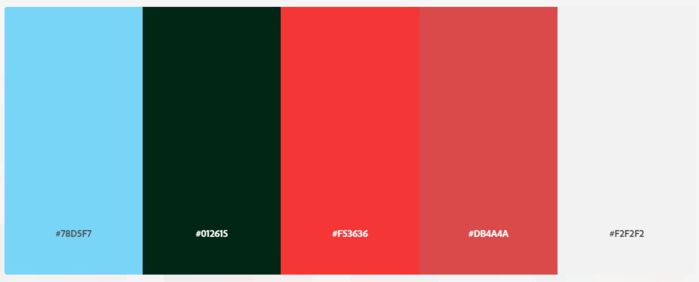  
  
I experienced an issue with the contrast ratio for my buttons. The ratio of the (#78D5F7) blue and (#F53636) red fell short of the acceptable [WCAG](https://www.w3.org/WAI/WCAG21/Understanding/contrast-minimum.html) contrast ratio. To fix this and increase the accessibility of my site I used different shades of these colours to conform.  
  
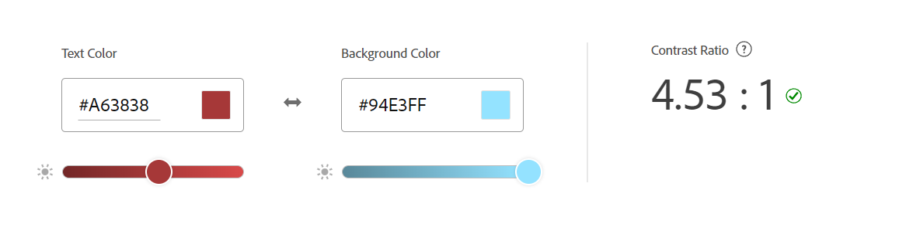  
  
[Adobe Color](https://color.adobe.com/create/color-contrast-analyzer) provided this fantastic resource for checking how accesible your colours are. I submitted my palette to the [Color Blind Safe](https://color.adobe.com/create/color-accessibility) check to find they passed this test also.  
  
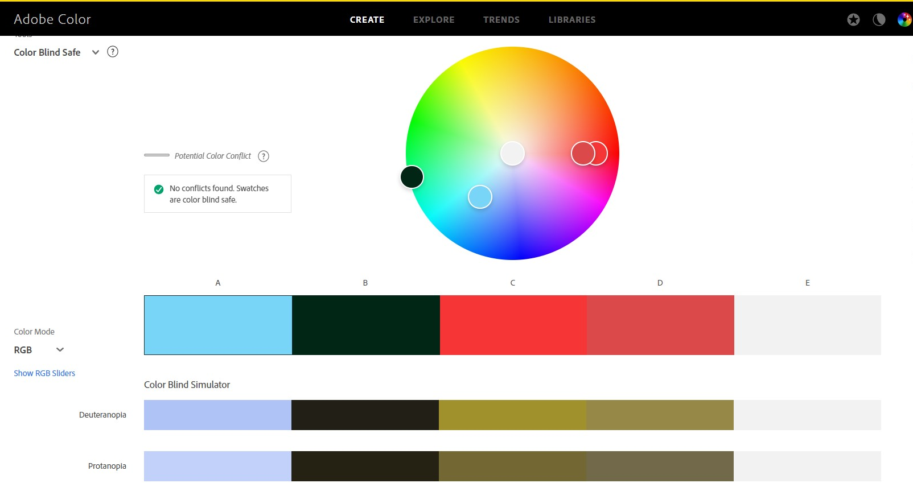
  
### **Font/Typography**  
  
[Google Fonts](https://fonts.google.com/) was used to import the fonts 'Josefin Sans' and 'Lato'. I felt the clear, soft lettering suited the intended aesthetic of the website. I had intentions to use Lato for my smaller bodies of text, however, I chose to stick with Josefin to keep the font consistent.   
  
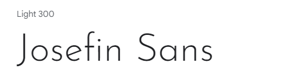

        
### **Imagery**  
  
The images that I have chosen for my site reflect the bright, retro aesthetic I am looking for. Close ups of large displays of ice cream create a positive feeling for the user, prompting them to delve further into the menu section. A large image sits below the menu options, it shows the most popular dessert of a warm brownie with a scoop of delicious ice cream. The sites [pexels.com](https://www.pexels.com/), [unsplash.com](https://unsplash.com/) and [pixabay.com](https://pixabay.com/) provided the royalty-free stock images used throughout the website, with attributions to each photographer placed in the [Credits](#credits) section of this README doc.

---  

   

## Page Features  

### **Navbar**   

  

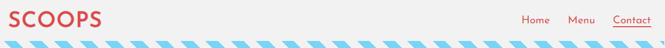 

This remains the same across the three pages, in portrait/landscape and mobile/tablet/desktop view.
  
   

### **Hero Image**  

  

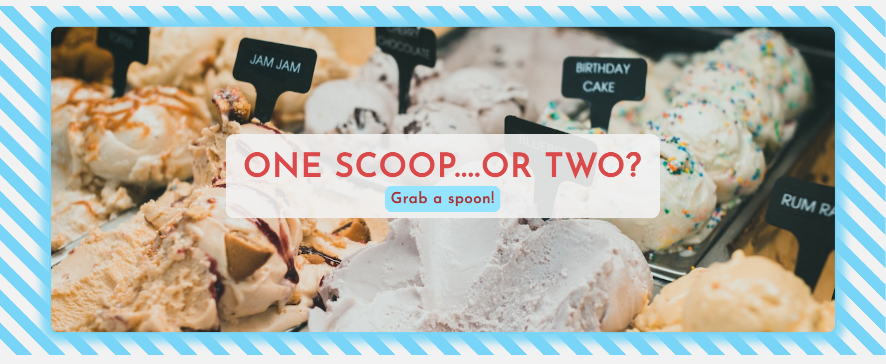  

The hero image remains the same across all devices, with it becoming square-shaped for smaller screens.  

  

### **Tagline & Call to Action**  

 

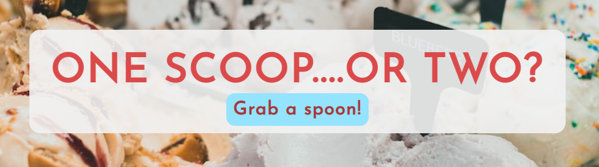  

The tagline image has it's opacity set to allow the hero image to still show through. The call to action button was given different shades of the original colour palette to allow its contrast ratio to conform to the accessibility needs of the site.

 

### **Business Ethos**  

 

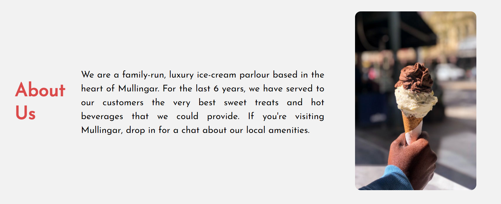  

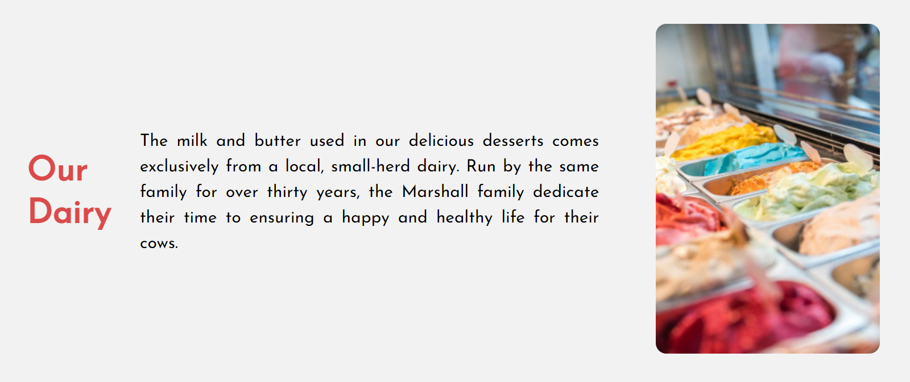  

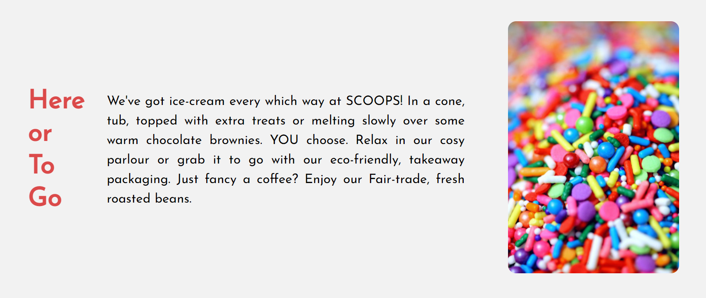  

Small portions of text with clear headings are accompanied by striking images that reflect the ice cream parlour's products. In tablet/mobile view, these sections are displayed in a column.  

 
  
### **Menu Page** 

 

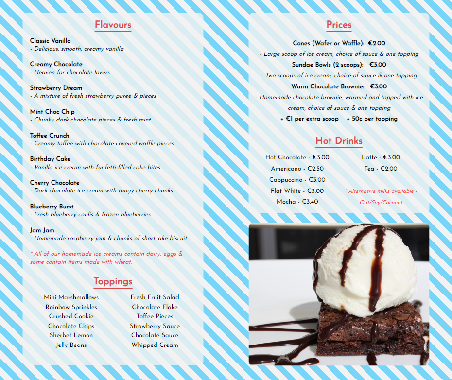  

The striped design occupies the whole page, with off-white backgrounds styled with a lower opacity displaying the menu items available at SCOOPS. A large image of a warm brownie is situated at the end of the menu. The menu format switches to columnar for the tablet/mobile views.

 

### **Contact Page**  

 
 
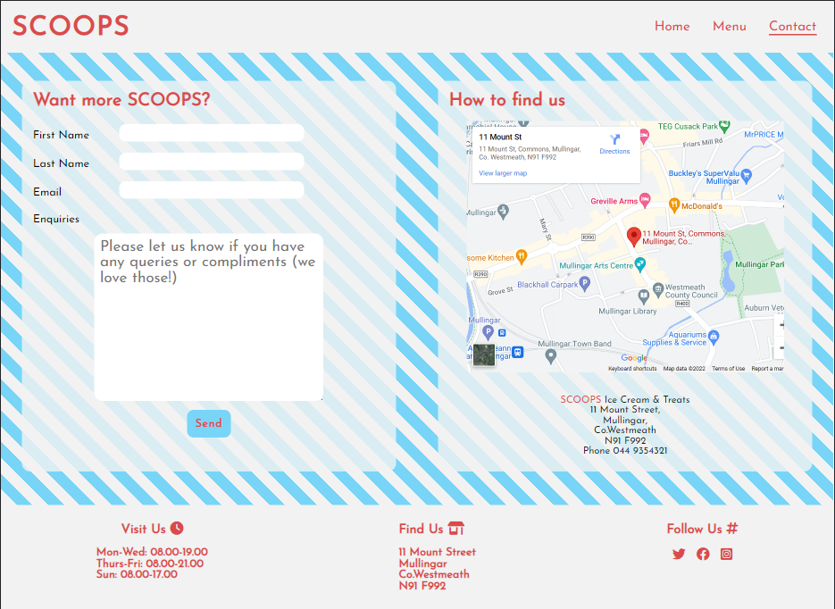  

Similar to the menu page design. Two sections for contacting the business with a form element and an embedded, interactive Google map, sitting in a row. These elements switch to columnar format for tablet/mobile views.

 

### **Footer**  

 

The footer remains the same throughout the design. It contains important information for the user and a clickable link to the map page in the 'Find Us' heading.  

---   

 

## Tablet & Mobile View  
 
### **Desktop, Tablet & Mobile Differences**  
  
To ensure responsivity I used Flexbox in my CSS styling. Main elements in the body of the site i.e. the business ethos, menu sections and contact sections were displayed in a row format for desktops but this switched to column for smaller screensizes. The header and footer remained the same, whilst images were resized to fit the display.
  
### **Tablet View (iPad Mini/iPad Pro/Surface Pro)**  
  
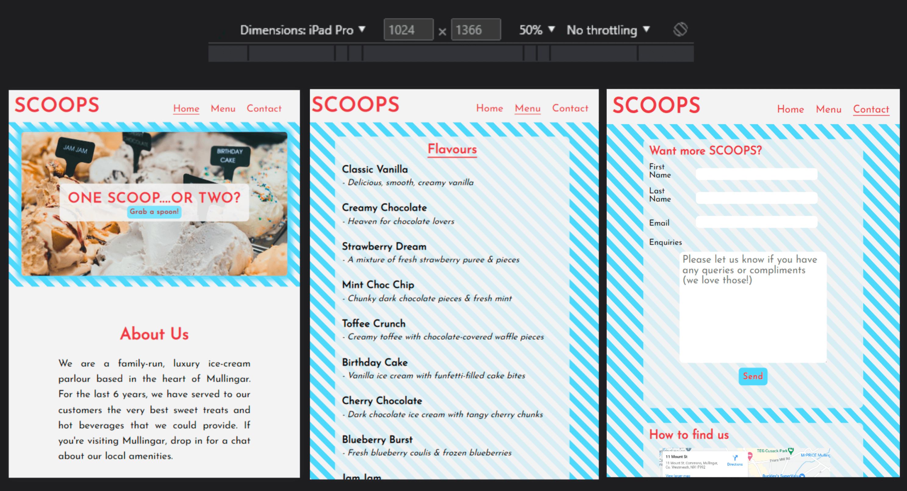

### **Mobile View (iPhone 5/iPhone SE/iPhone XR/iPhone 12 Pro)**  
  
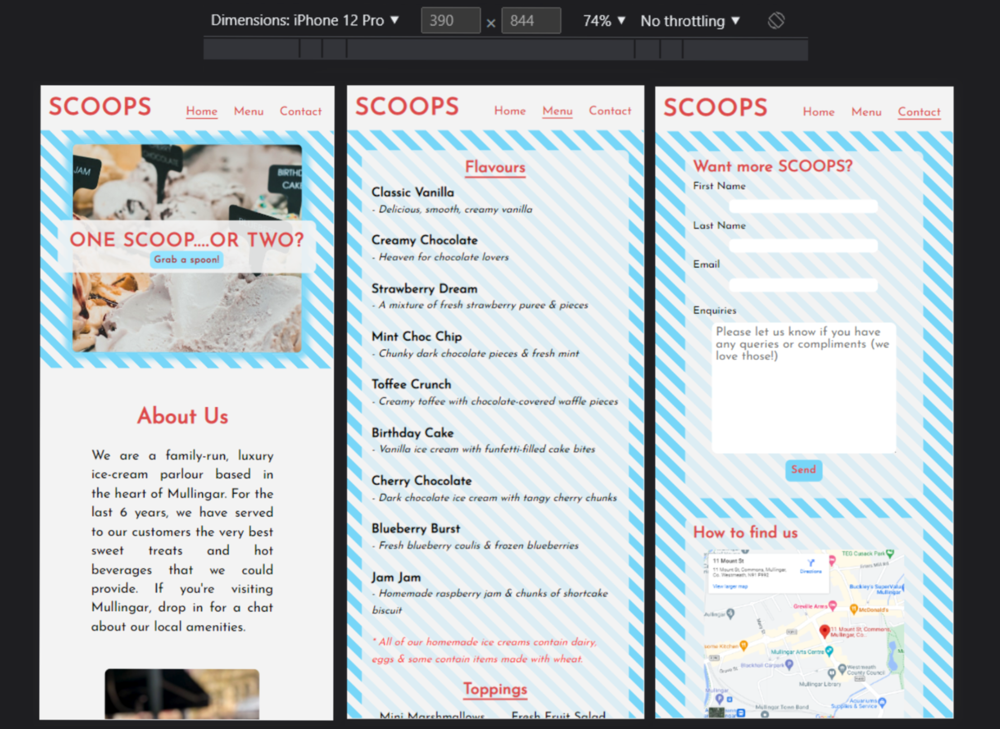

---  

                                

## Future Features  

- For future development I would like to include an ordering system on the website to allow customers to order menu items for takeaway and a form element for larger orders to cater for parties and events.  
- An embedded video of the in-house ice cream production, showing customers how to make ice cream from beginning to end.
- A gallery page of dessert specials, events held at the parlour and candid photos of customers and staff.
  
---   

   

## Technologies Used    

### **Languages Used**   

- HTML5
- CSS3

### **Frameworks, Libraries, Technologies & Programs Used**  

- Procreate - used to create wireframes and editing images 
- Github - used to save and store all files for this website  
- Git - used for version control
- Google Fonts - fonts were imported from here 
- Font Awesome - icons and their associated kit were downloaded from here  
- Adobe Color - for all color palettes and accessibility contrast ratios  
- Favicon.io - for ice cream favicon  
- Tiny PNG - to compress images 
- Google Dev Tools - to debug and for testing responsiveness 
- Google Lighthouse - for auditing the website
- W3C Validator - for validating the HTML and CSS code 

---   

  

## Deployment

### **How to deploy**  

Github was used to deploy the website. These were the steps taken to acheive this:  

1. Login to Github account
2. Navigate to the project repository, scoops_pp1
3. Click the Settings button near the top of the page
4. In the left-hand menu, find and click on the Pages button
5. In the Source section, choose 'main' from the drop down select branch menu
6. Select 'root' from the drop down folder menu
7. Click 'Save' and after a few moments the project will have been made live and a link is visible at the top of the page

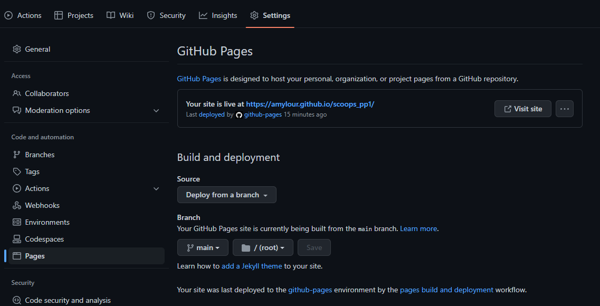 

---  

     

## Testing  

### **Initial testing plan**

I had planned for this site to be accessible and legible on all screen sizes. The user is viewing the site primarily for the menu options and parlour location and they needed to access this information within one click. I used Chrome Dev Tools to test, tweak and debug in the early stages. I deployed my site half way through to test on real world devices. These devices included:  
- Acer Aspire 3 Laptop (1920 X 1080)  
- Huawei AD80HW 24" Monitor
- i Pad Pro 2021
- iPhone SE(2016)
- Huawei p30 Lite  
  
### **Testing**    

Testing took place throughout the entire build using Dev Tools on Chrome and on the above real-world devices. The results of feature testing are as follows:  
  
| Page | Test | Pass/Fail |
| :----| :----| :--------:|
| All  | SCOOPS logo links back to homepage | Pass |
| All  | Underline appears under navigation items when mouse hovers | Pass |
| All  | Underline stays under active navigation item | Pass |
| All  | Navigation links bring user to relevant page | Pass |
| All  | Footer social media icons bring user to relevant sites via new tab | Pass |
| All  | 'Find Us' heading in footer links to contact page | Pass |
| All  | Images and sections are responsive in different media sizes | Pass |
| Index| Hero image zooms in on loading | Pass |
| Index| Call to Action button links to menu page | Pass | 
| Menu | Menu is scrollable | Pass |
| Menu | Menu items are clear and legible | Pass |
| Contact | Contact form required elements are responsive | Pass |
| Contact | Form submit button brings you to validation page | Pass |
| Contact | Google Map is interactive and opens in new tab for larger map | Pass |
  

  
### **HTML Validation using W3C Validation**  

Index/landing page HTML validation
  

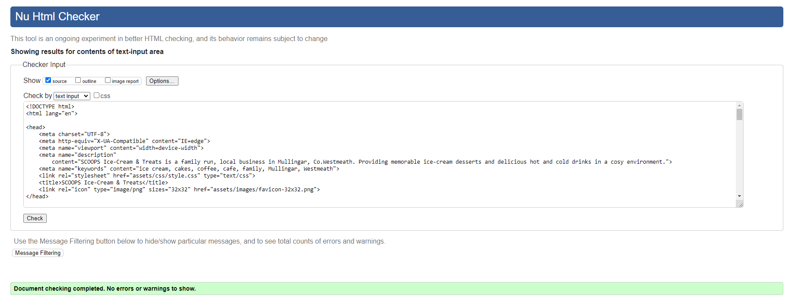

   

Menu page HTML validation
  

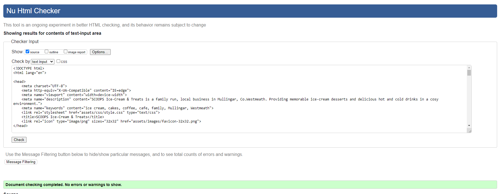

  

Contact page HTML validation
  

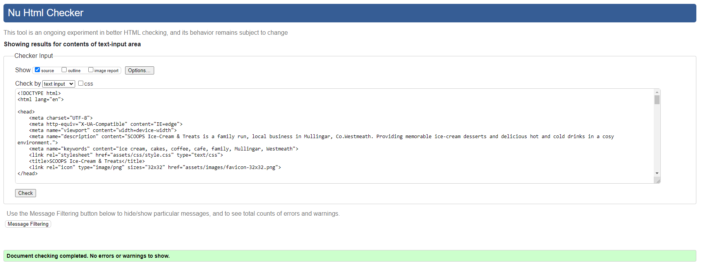

  
  
   

### **CSS Validation using W3C Validation** 

SCOOPS CSS validation
  

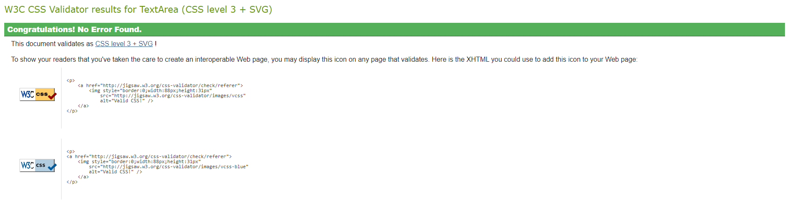

   

   

### **Lighthouse scores via Chrome Developer Tools**   
  
For Desktop   

Lighthouse audit for Index page
  

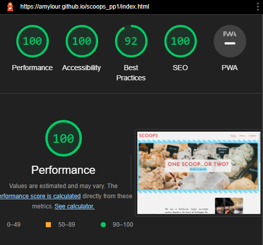

 

Lighthouse audit for Menu page
  

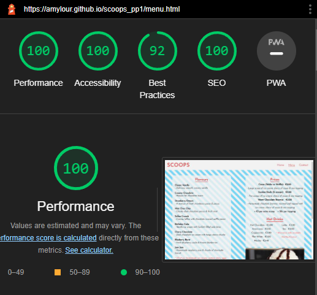

Lighthouse audit for Contact page
  

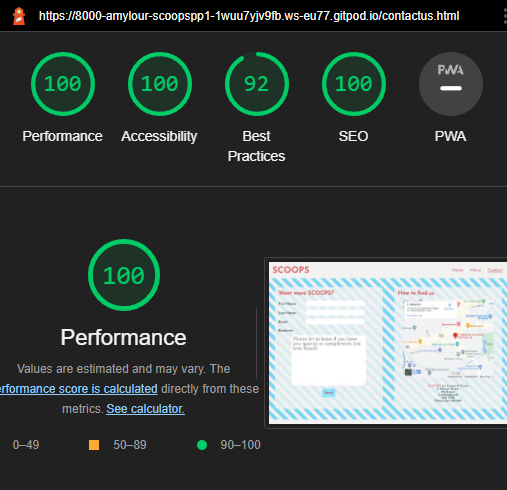

      

 
  
  
### **Bugs & Fixes**  
White space RHS webpage - padding issue in footer - developer mistype  
Contrast ratio - adjusting colors  
Flexbox issues - business ethos and images spacing, footer rising  
Responsiveness  

---  

## Credits  
  
### **Content References**
- All content written for the website is by myself, is purely fictional and for educational purposes only.
- [Code Institute](https://codeinstitute.net/ie/) for their HTML/CSS learning material and 'content zoom' module in the Love Running project.
- [W3Schools](https://www.w3schools.com/) for additional learning material.
- [MDN Web Docs](https://developer.mozilla.org/en-US/docs/Learn/CSS/CSS_layout/Flexbox) for flexbox tutorials and guidance.
- [dev.to](https://dev.to/snkds/how-to-create-striped-backgrounds-with-css-5dfn) for the CSS diagonal stripes tutorial.
- [Browserstack](https://www.browserstack.com/guide/what-are-css-and-media-query-breakpoints#:~:text=Essentially%2C%20media%20query%20breakpoints%20are,offers%20an%20optimal%20user%20experience.) for media queries and breakpoints guidance.
- [Kera Cudmore - Creating your First README](https://github.com/kera-cudmore/readme-examples) for README structure and Markdown guidance. 
  

### **Media References**  
  
- [Unsplash](https://unsplash.com/), [Pexels](https://www.pexels.com/), and [Pixabay](https://pixabay.com/) for all images used on this site. Credit to photographers Jonathan Cooper, Lukas, Katie Rainbow, Kyle Hinkson and Dulce Silvagni.
- [Font Awesome](https://fontawesome.com/) for the icons used in the footer of this site.
- [Favicon](https://favicon.io/) for the favicon used for this site.
- [Google Maps](https://www.google.com/maps) for the map used in this site.

### **Acknowledgements** 
- I would like to acknowledge my Code Institute mentor, Rahul Lakhanpal, for his guidance and encouragement on this project.
- My family for testing my work and offering positive thoughts and hot cups of tea throughout the project.

